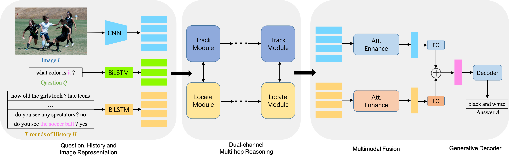

DMRM: A Dual-channel Multi-hop Reasoning Model for Visual Dialog
========================================================================

Pytorch Implementation for the paper:

**[DMRM: A Dual-channel Multi-hop Reasoning Model for Visual Dialog][11]** <br>
Feilong Chen, Fandong Meng, Jiaming Xu, Peng Li, Bo Xu,and Jie Zhou <br>
In AAAI 2020 

<!---->



Setup and Dependencies
----------------------
This code is implemented using **PyTorch v0.3.0** with **CUDA 8 and CuDNN 7**. <br>
It is recommended to set up this source code using Anaconda or Miniconda. <br>

1. Install Anaconda or Miniconda distribution based on **Python 3.6+** from their [downloads' site][2].
2. Clone this repository and create an environment:

```sh
git clone https://github.com/phellonchen/DMRM.git
conda create -n dmrm_visdial python=3.6

# activate the environment and install all dependencies
conda activate dmrm_visdial
cd $PROJECT_ROOT/
pip install -r requirements.txt
```

Download Features
----------------------
1. Download the VisDial dialog json files from [here](https://visualdialog.org/data) and keep it under `$PROJECT_ROOT/data` directory, for default arguments to work effectively.

2. We used the Faster-RCNN pre-trained with Visual Genome as image features. Download the image features below, and put each feature under `$PROJECT_ROOT/data` directory. 
  * [`features_faster_rcnn_x101_train.h5`](https://s3.amazonaws.com/visual-dialog/data/v1.0/2019/features_faster_rcnn_x101_train.h5): Bottom-up features of 36 proposals from images of `train` split.
  * [`features_faster_rcnn_x101_val.h5`](https://s3.amazonaws.com/visual-dialog/data/v1.0/2019/features_faster_rcnn_x101_val.h5): Bottom-up features of 36 proposals from images of `val` split.
  * [`features_faster_rcnn_x101_test.h5`](https://s3.amazonaws.com/visual-dialog/data/v1.0/2019/features_faster_rcnn_x101_test.h5): Bottom-up features of 36 proposals from images of `test` split.

3. Download the GloVe pretrained word vectors from [here][9], and keep `glove.6B.300d.txt` under `$PROJECT_ROOT/data` directory.

Data preprocessing & Word embedding initialization
----------------------
```sh
# data preprocessing
cd $PROJECT_ROOT/script/
python prepro.py

# Word embedding vector initialization (GloVe)
cd $PROJECT_ROOT/script/
python create_glove.py
```

Training
--------
Simple run
```sh
python main_v0.9.py or python main_v1.0.py 
```

### Saving model checkpoints  
Our model save model checkpoints at every epoch and undate the best one. You can change it by editing the `train.py`. 

### Logging
Logging data `$PROJECT_ROOT/save_models/time/log.txt` shows epoch, loss, and learning rate.

Evaluation
--------
Evaluation of a trained model checkpoint can be evaluated as follows:
```sh
python eval_v0.9.py or python eval_v1.0.py
```

Results
--------
Performance on `v0.9 val-std` (trained on `v0.9` train):

  Model  |  MRR   |  R@1  | R@5  |  R@10   |  Mean  |
 ------- | ------ | ------ | ------ | ------ | ------ |
 DMRM    | 55.96 | 46.20 | 66.02 | 72.43 | 13.15 |

Performance on `v1.0 val-std` (trained on `v1.0` train):

   Model  |  MRR   |  R@1  | R@5  |  R@10   |  Mean  |
 ------- | ------ | ------ | ------ | ------ | ------ |
 DMRM    | 50.16 | 40.15 | 60.02 | 67.21 | 15.19 |
 
 If you find this repository useful, please consider citing our work:
 ```
 @inproceedings{chen2020dmrm,
  title={DMRM: A dual-channel multi-hop reasoning model for visual dialog},
  author={Chen, Feilong and Meng, Fandong and Xu, Jiaming and Li, Peng and Xu, Bo and Zhou, Jie},
  booktitle={Proceedings of the AAAI Conference on Artificial Intelligence},
  volume={34},
  number={05},
  pages={7504--7511},
  year={2020}
}
```
License
--------
MIT License

[1]: https://arxiv.org/abs/1902.09368
[2]: https://conda.io/docs/user-guide/install/download.html
[3]: https://drive.google.com/file/d/1NYlSSikwEAqpJDsNGqOxgc0ZOkpQtom9/view?usp=sharing
[4]: https://drive.google.com/file/d/1QSi0Lr4XKdQ2LdoS1taS6P9IBVAKRntF/view?usp=sharing
[5]: https://drive.google.com/file/d/1NI5TNKKhqm6ggpB2CK4k8yKiYQE3efW6/view?usp=sharing
[6]: https://drive.google.com/file/d/1nTBaLziRIVkKAqFtQ-YIbXew2tYMUOSZ/view?usp=sharing
[7]: https://drive.google.com/file/d/1BXWPV3k-HxlTw_k3-kTV6JhWrdzXsT7W/view?usp=sharing
[8]: https://drive.google.com/file/d/1_32kGhd6wKzQLqfmqJzIHubfZwe9nhFy/view?usp=sharing
[9]: http://nlp.stanford.edu/data/glove.6B.zip 
[10]: https://evalai.cloudcv.org/web/challenges/challenge-page/161/overview
[11]: https://arxiv.org/abs/1912.08360
